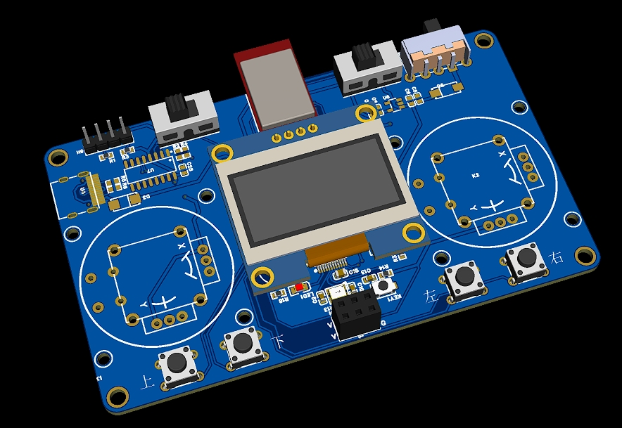
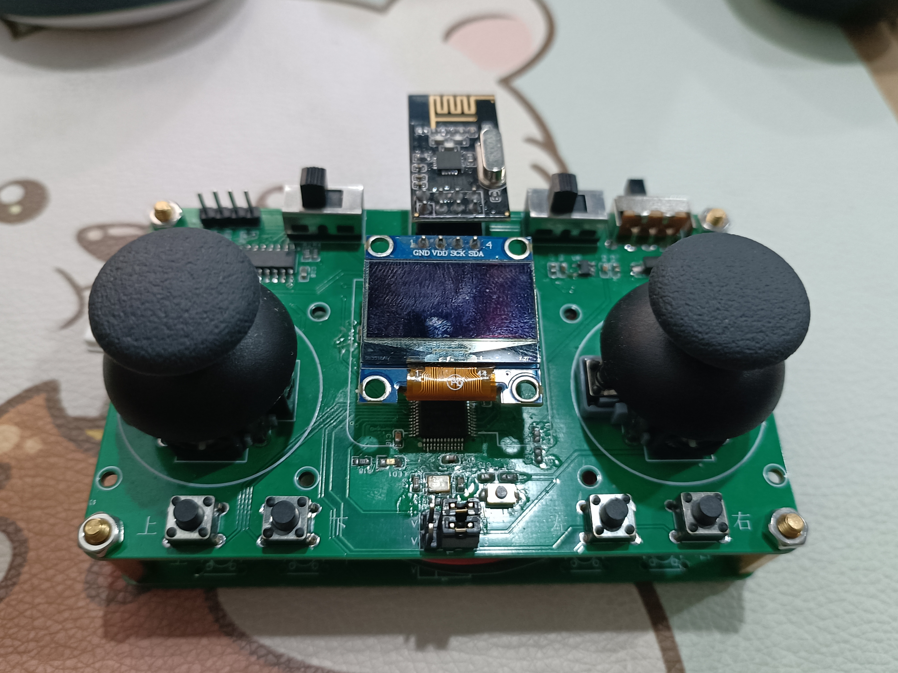

# 项目说明

该项目是一个基于FreeRTOS系统的Stm32遥控器设计。使用该项目主要学习FreeRTOS的使用，以及模块化编程的思想。

# 项目开源

github:https://github.com/snqx-lqh/Stm32RemoteControl

gitee:https://gitee.com/snqx-lqh/Stm32RemoteControl

github的更新应该相对比较新一点，gitee是拉取的，有时候可能会忘

开源文件夹中

CodeRx是用正点原子mini板连接的一个NRF24L01模块做的接收测试，自己测试的话换一下引脚就可以了。

CodeTxFreeRtos是遥控器使用的代码。

Hardware是硬件设计的原理图，使用的嘉立创

img保存的一些图片

# 硬件设计

## 原理图设计

具体设计图去开源链接查看，这里说大概这个项目包含哪些模块。

主控：stm32f103cbt6，但是原理图画的C8T6不影响，只是存储大小的问题

陀螺仪：mpu6050

无线传输：NRF24L01

遥杆：16x16/10K回中

显示：0.96OLED iic接口

## 实物展示





# 软件设计

## FreeRTOS结构

整体的结构是一个开始任务，然后创建几个任务，中间还有任务是需要挂起和唤醒的

`start_task`：这个任务主要拿来创建任务，创建完成后就删除任务
`user_task`：这个任务拿来做一些测试，比如检查每个任务的栈剩余空间
`rc_data_task`：这个任务拿来做获取遥控器的数据
`nrf_task`：这个任务拿来做无线数据的发送
`gui_task`：这个任务拿来做显示器的界面显示
`shell_task`：这个任务拿来做串口的shell输出，移植的是开源项目letter-shell
`ano_task`：这个任务拿来做上位机显示数据，移植的是开源项目匿名上位机
`game_task`：这个任务拿来做游戏测试，常规是未初始化的，在gui_task里面会对他进行删除和创建。

## start_task

开始任务，在这个任务里面，定义了各个任务所需要的栈空间大小，优先级，任务句柄，将任务创建完成后就删除这个开始任务。在开始任务中还定义了一个互斥量，这个互斥量拿来防止获取遥控器数据时的冲突。

## user_task

这个任务自己做测试使用，我在这个里面使用了读取剩余栈空间大小的函数，输入任务句柄就能查看。

```C
UBaseType_t uxHighWaterMark;
uxHighWaterMark = uxTaskGetStackHighWaterMark( USERTask_Handler );
```

## rc_data_task

这个任务主要拿来获取遥控器的数据，包括遥杆数据，电源数据，按键数据，陀螺仪数据。

遥感数据、电源数据其实就是读adc的值

按键数据既读取了原始按键值，也通过KeyScan按键扫描获得按键按下的状态，获得按下的状态在界面控制里面会使用

陀螺仪数据就是普通的读取6050的数据。

这里介绍一下陀螺仪部分的驱动分离的思想。

陀螺仪使用的是软件IIC读取的，软件IIC也使用了驱动分离，先说陀螺仪。

在mpu6050_driver文件中，定义了mpu6050的操作函数mpu6050_operations。然后在写相关功能的时候，使用的是结构体指针，这样的话。我后面只需定义一个mpu6050操作函数的结构体，然后重写里面的操作函数，就可以实现调用6050里面的函数，如果有两个6050，定义两个操作函数结构体就行，然后在获取数据的时候，传入不同的结构体变量就可以实现不同的设备获取数据，而不用修改这个driver文件。

至于里面的实现，参考的就是正点原子的代码，做了一些删减，和定义。

至于软件IIC，思想和陀螺仪一样，包括软件的spi和ssd1306都是这样，定义一个操作函数的结构体，然后使用函数指针的方式来写应用，实际使用的时候，只需要初始化一个结构体，然后重写结构体里面的函数就可以了。

## nrf_task

这个任务里面初始化nrf24L01的使用，至于设备的实现，和6050很像，移植的代码还是正点原子的，只不过我改成了指针实现的方式。为了实现方便移植。

## gui_task

这个里面的相关函数实现看我之前的博客https://blog.csdn.net/wan1234512/article/details/123021240

在这里，加了一些的东西就是，在game那里，使用了创建任务的方式，然后传入参数，创建后挂起GUI任务，在game_task中，实现完成后，又恢复gui_task。

## shell_task

这个移植的开源项目letter-shell，我移植的是3.0版本，https://github.com/NevermindZZT/letter-shell/tree/shell3.0，但是这个任务我一般没有打开使用，他的串口接收，是放在的bsp_usart里面

## ano_task

这个移植的是匿名助手，https://gitee.com/anotc/AnoAssistant，他的接收部分也是放在的bsp_usart里面。

## game_task

这个任务的创建是在gui_task里面实现的，然后里面目前实现了一个弹球的游戏。

